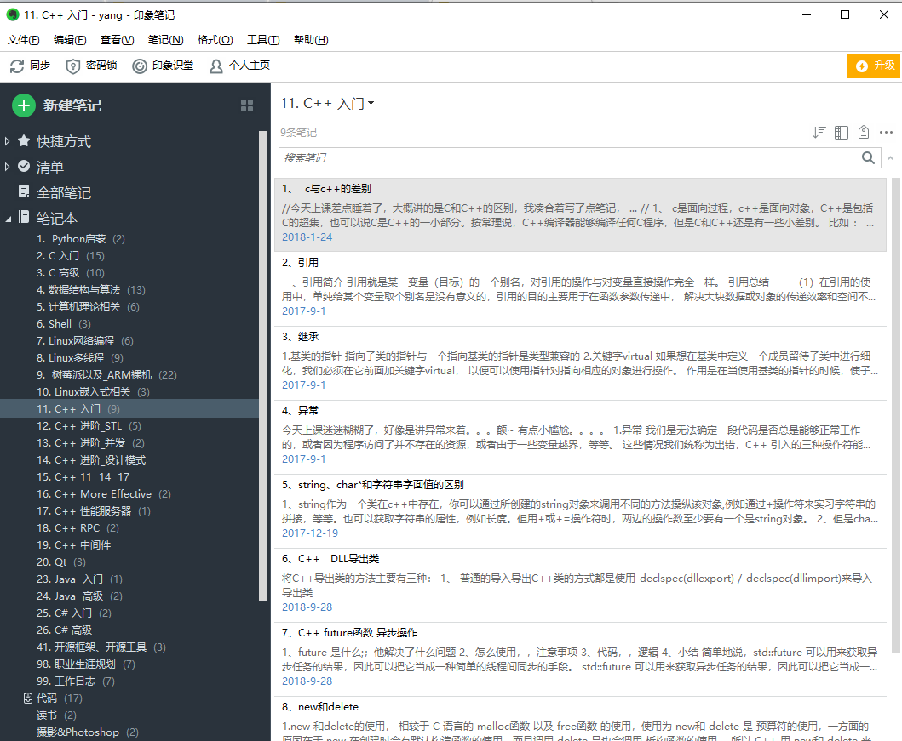

# Notes-library

>
>Here are some notes to help college students learn programming and employment.
>These notes are organized by me, I hope you like it.

*Sincere blessing, I hope you have a bright future*

*I work on the small project on my own so the code lacks of comments.*

## 初心

得益于陈文娟老师和赵丽芬老师的启发和帮助，在她们的支持下，我搭建了这个网络仓库，用于帮助大学生学习编程以及就业，
仓库的内容笔者结合当初学习时留下的笔记和现在的想法，经过整理放到仓库里的，当然不仅仅是一些学习笔记，资料整理，在
后期计划中也会有程序源码，项目源码，二级考试四级考试干货，学习技巧方法论，PS,Pr教程视频，有趣的娱乐项目，以及如何
翻墙等，仓库会逐步完善，甚至说如果你不喜爱编程，这里也是一个干货聚集地，用于帮助你的成长，当然，你得有一颗求知的心。

## 下载

仓库的存放形式，以文件夹的形式存放，可以在线查看预览，下载仓库也很简单，点击github网站的按键clone or Download就可以了，
单个文档下载，点击文档，找到Raw按钮 可以查看，在查看界面右键，“另存为”即可。关于github的使用，如果你不会，你可以百度，这里不再复述。
文件的格式一般是 .md 或者是 .pdf,你可以使用任何支持Markdown的工具打开md文件，这里推荐VS Code，详细使用请百度

## 说明

该项目是开源项目，您不能使用于任何商用价值或者违规操作，后面是一些条款

## 版权
资料收集来自互联网,如有侵犯,请联系本人,将第一时间删除.
收藏请点star；如果发现我有写错误的，欢迎随时帮我改正，或者增加新的观点，谢谢！

## License and Credits
Notes-Library with 
various licenses. Unfortunately I failed to track them all. In other word, there are many stuff excluding code that comes with unknown license. You should not reuse any of audio, bitmaps, font in this project. If you insist, use at your own risk.
 

## History
|Name|History Time|
|----|-------|
|完成第一阶段python相关资料的导入|2020-03-01|
|把资料导入仓库|2020-01-18|
|创建github仓库，并开始维护|2019-12-24|
|整理文件资料，查阅笔记重新编写 |2019-12-08|

